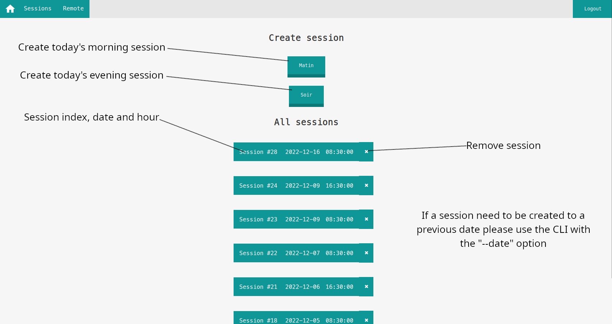
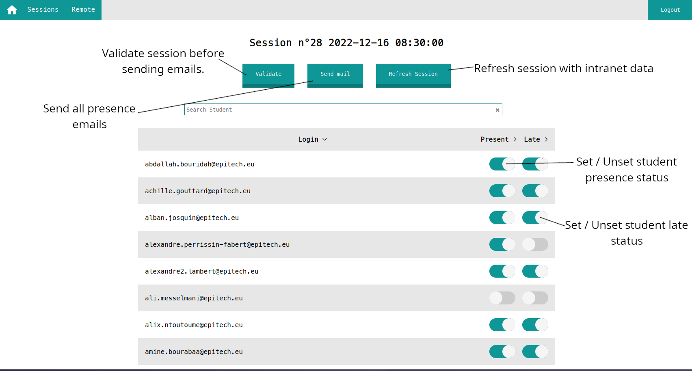
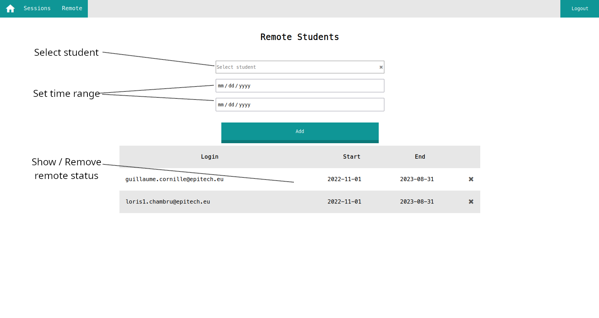

# Clicodrome
Outil d'automatisation des tâches d'émargement pour Epitech MSC

# Technologies
- [FastAPI](https://fastapi.tiangolo.com/), [Python](https://www.python.org/)
- [React](https://react.dev/), [JavaScript](https://developer.mozilla.org/fr/docs/Web/JavaScript)

# Demo




# Prerequisite
- Sessions intranet [exemple](https://intra.epitech.eu/module/2021/W-ADM-007/LYN-0-1/acti-505014/event-521736/registered) (DEPRECATED)
- Compte Edusign avec l'école concernée / les promotions.
- Docker
- Docker-compose

# Procedure (DEPRECATED)
- Create all attendance sessions on epitech intranet ([tool](https://github.com/JulienAldon/EEPlanner)).
- Create session for clikodrome
- Sign student attendance using [clicoscan](https://github.com/JulienAldon/Clicoscan).

> **_NOTE:_** The procedure will change to incorporate Clicoscan in the future.

# Setup
## Oauth2 application
- Go to [azure portal](https://portal.azure.com/#view/Microsoft_AAD_IAM/ActiveDirectoryMenuBlade/~/RegisteredApps)
- Create a new application, save the `CLIENT_SECRET`.
- Get the `TENANT_ID` and `CLIENT_ID` these variables are required for the application to work properly.
- Configure the redirect URIs : Go to `Authentification > Web > Redirect URIs > Add URI` and add `https://<your-uri>/api/auth/redirect` `your-uri` can be anything even localhost for development purposes.
- Finally configure the app permission : go to `API Permissions > Add a permission > Microsof Graph` add `email`, `openid`, `User.Read`, `User.ReadBasic.All`

## Configuration
You can find under `back/src/configuration.example.py` an example configuration for the application.

Here are the mandatory variables : 
- `JWT_ORIGIN` : for microsoft `https://login.microsoftonline.com/<tenant_id>`.
- `JWT_ISSUER` : JWT creator (iss) for microsoft `https://login.microsoftonline.com/<tenant_id>/V2.0`.
- `AZURE_CLIENT_ID` : Azure `CLIENT_ID`.
- `AZURE_CLIENT_SECRET` : Azure `CLIENT_SECRET`.
- `INTRANET_AUTOLOGIN` : Epitech intranet autologin.
- `DATABASE_HOST` : Database host or `<name of the database docker service>`.
- `DATABASE_USER` : Database user.
- `DATABASE_PASSWORD` : Database password.
- `DATABASE_NAME` : Database name.
- `EDUSIGN_LOGIN` : Edusign login.
- `EDUSIGN_PASSWORD` : Edusign password.

## Signature
Create a `signature.txt` at the root of the repository, this is the signature used when signing edusign session.


## Deploy
You can deploy this application on any machine, all you need, is a domain name and correct oauth2 configuration.
Dont forget to configure SSL with Certbot.

### Docker Compose
Finnaly you can launch the application with :
```bash
docker-compose up --build
```